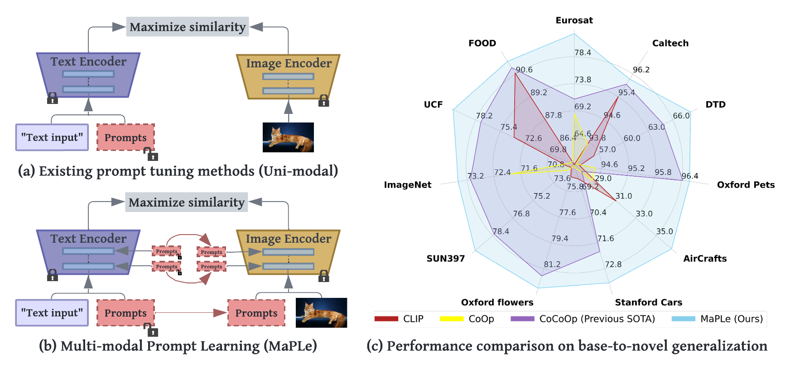

# MaPLe: Multi-modal Prompt Learning [CVPR 2023]


> [**MaPLe: Multi-modal Prompt Learning**](https://arxiv.org/abs/2210.03117)<br>
> [Muhammad Uzair Khattak](https://scholar.google.com/citations?user=M6fFL4gAAAAJ&hl=en&authuser=1), [Hanoona Rasheed](https://scholar.google.com/citations?user=yhDdEuEAAAAJ&hl=en&authuser=1&oi=sra), [Muhammad Maaz](https://scholar.google.com/citations?user=vTy9Te8AAAAJ&hl=en&authuser=1&oi=sra), [Salman Khan](https://salman-h-khan.github.io/), [Fahad Shahbaz Khan](https://scholar.google.es/citations?user=zvaeYnUAAAAJ&hl=en)


[](https://muzairkhattak.github.io/multimodal-prompt-learning/)
[](https://arxiv.org/abs/2210.03117)


Official implementation of the paper "[MaPLe: Multi-modal Prompt Learning](https://arxiv.org/abs/2210.03117)".
<hr />

Base-to-novel generalization:

[](https://paperswithcode.com/sota/prompt-engineering-on-imagenet?p=maple-multi-modal-prompt-learning)
[](https://paperswithcode.com/sota/prompt-engineering-on-sun397?p=maple-multi-modal-prompt-learning)
[](https://paperswithcode.com/sota/prompt-engineering-on-eurosat?p=maple-multi-modal-prompt-learning)
[](https://paperswithcode.com/sota/prompt-engineering-on-ucf101?p=maple-multi-modal-prompt-learning)
[](https://paperswithcode.com/sota/prompt-engineering-on-fgvc-aircraft?p=maple-multi-modal-prompt-learning)


Domain Generalization:

[](https://paperswithcode.com/sota/prompt-engineering-on-imagenet-r?p=maple-multi-modal-prompt-learning)
[](https://paperswithcode.com/sota/prompt-engineering-on-imagenet-a?p=maple-multi-modal-prompt-learning)
[](https://paperswithcode.com/sota/prompt-engineering-on-imagenet-s?p=maple-multi-modal-prompt-learning)


<hr />

# :rocket: News
* **(Feb 28, 2023)**
  * Paper accepted at CVPR 2023 :tada: 
* **(Oct 06, 2022)** 
  * Training and evaluation codes for [MaPLe](configs/trainers/MaPLe), along with pretrained models are released.
  * The repository also supports
[CoOp](configs/trainers/CoOp),
[Co-CoOp](configs/trainers/CoCoOp),
[Deep Vision Prompting](configs/trainers/VPT/vit_b16_c2_ep5_batch4_4.yaml),
[Deep Language Prompting](configs/trainers/IVLP/vit_b16_c2_ep5_batch4_4ctx_language_only.yaml), and 
[Independent V-L Prompting](configs/trainers/IVLP/vit_b16_c2_ep5_batch4_2+2ctx.yaml)
architectures.
<hr />

## Highlights


> **<p align="justify"> Abstract:** *Pre-trained vision-language (V-L) models such as CLIP have shown excellent 
> generalization ability to downstream tasks. However, they are sensitive to the choice of input text prompts and 
> require careful selection of prompt templates to perform well. Inspired by the Natural Language Processing (NLP) 
> literature, recent CLIP adaptation approaches learn prompts as the textual inputs to fine-tune CLIP for downstream 
> tasks. We note that using prompting to adapt representations in a single branch of CLIP (language or vision) is 
> sub-optimal since it does not allow the flexibility to dynamically adjust both representation spaces on a downstream 
> task. In this work, we propose Multi-modal Prompt Learning (MaPLe) for both vision and language branches to improve 
> alignment between the vision and language representations. Our design promotes strong coupling between the 
> vision-language prompts to ensure mutual synergy and discourages learning independent uni-modal solutions. 
> Further, we learn separate prompts across different early stages to progressively model the stage-wise feature 
> relationships to allow rich context learning. We evaluate the effectiveness of our approach on three representative 
> tasks of generalization to novel classes, new target datasets and unseen domain shifts. Compared with the 
> state-of-the-art method Co-CoOp, MaPLe exhibits favorable performance and achieves an absolute gain of 3.45% on novel 
> classes and 2.72% on overall harmonic-mean, averaged over 11 diverse image recognition datasets. Our code and models 
> will be publicly released.* </p>

## Main Contributions

1) **Multi-modal prompt learning:** Adapt CLIP using a novel prompting technique which prompts both the vision and language branch of CLIP.
2) **Vision and Language Prompt Coupling:** Explicitly condition vision prompts on their language counterparts and act as a bridge
between the two modalities by allowing mutual propagation of gradients to promote synergy.
3) **Vision and Language Deep Prompting:** Learn multi-modal prompts across multiple transformer blocks in both vision and
language branches to progressively learn the synergistic behaviour of both modalities.


## :ballot_box_with_check: Supported Methods

[comment]: <> (| Language Prompting            | MaPLe |  [link]&#40;configs/trainers/IVLP/vit_b16_c2_ep5_batch4_4ctx_language_only.yaml&#41;      |      |)

| Method                    | Paper                                         |                             Configs                             |          Training Scripts          |
|---------------------------|:----------------------------------------------|:---------------------------------------------------------------:|:----------------------------------:|
| MaPLe                     | [arXiv](https://arxiv.org/abs/2210.03117)                                     | [link](configs/trainers/MaPLe/vit_b16_c2_ep5_batch4_2ctx.yaml)  |       [link](scripts/maple)        |
| CoOp                      | [IJCV 2022](https://arxiv.org/abs/2109.01134) |                  [link](configs/trainers/CoOp)                  |        [link](scripts/coop)        |
| Co-CoOp                   | [CVPR 2022](https://arxiv.org/abs/2203.05557) |                 [link](configs/trainers/CoCoOp)                 |       [link](scripts/cocoop)       |
| Deep Vision Prompting     | -                                             |    [link](configs/trainers/VPT/vit_b16_c2_ep5_batch4_4.yaml)    |        [link](scripts/vpt)         |
| Deep Language Prompting   | -                                             |                 [link](configs/trainers/IVLP/vit_b16_c2_ep5_batch4_4ctx_language_only.yaml)                  | [link](scripts/language-prompting) |
| Independent V-L Prompting | -                                             | [link](configs/trainers/IVLP/vit_b16_c2_ep5_batch4_2+2ctx.yaml) |  [link](scripts/independent-vlp)   |

<hr />

## Results
### MaPLe in comparison with existing methods
Results reported below show accuracy for base and novel classes for across 11 recognition datasets averaged over 3 seeds.

| Name                                                      | Base Acc. | Novel Acc. |    HM     | Epochs | 
|-----------------------------------------------------------|:---------:|:----------:|:---------:|:------:|
| [CLIP](https://arxiv.org/abs/2103.00020)                  |   69.34   |   74.22    |   71.70   |   -    |  
| [CoOp](https://arxiv.org/abs/2109.01134)                  | **82.69** |   63.22    |   71.66   |  200   | 
| [CoCoOp](https://arxiv.org/abs/2203.05557) |   80.47   |   71.69    |   75.83   |   10   | 
| [MaPLe (ours)](https://arxiv.org/abs/2210.03117)  |   82.28   | **75.14**  | **78.55** |   5    |  

## Installation 
For installation and other package requirements, please follow the instructions detailed in [INSTALL.md](docs/INSTALL.md). 

## Data preparation
Please follow the instructions at [DATASETS.md](docs/DATASETS.md) to prepare all datasets.

## Model Zoo

### Vision-Language prompting methods
| Name  (configs)                                                                                | Base Acc. | Novel Acc. |    HM     | Epochs |                                         Model / Logs                                         |
|------------------------------------------------------------------------------------------------|:---------:|:----------:|:---------:|:------:|:--------------------------------------------------------------------------------------------:|
| [Deep Vision Prompting](configs/trainers/VPT/vit_b16_c2_ep5_batch4_4.yaml)                     |   80.24   |   73.43    |   76.68   |   5    |        [link](https://drive.google.com/drive/folders/1zJnaod8UVvo1HuxNzymLhBBS_OHq6cYp?usp=sharing)                                                                                      | 
| [Deep Language Prompting](configs/trainers/IVLP/vit_b16_c2_ep5_batch4_4ctx_language_only.yaml) |   81.72   |   73.81    |   77.56   |   5    | [link](https://drive.google.com/drive/folders/1PPLtvQIGprRUyxPiTwOSEh_oQ46zQfCN?usp=sharing) |
| [Independent V-L Prompting](configs/trainers/IVLP/vit_b16_c2_ep5_batch4_2+2ctx.yaml)           |   82.15   |   74.07    |   77.90   |   5    | [link](https://drive.google.com/drive/folders/14NxzrRirK2GfyfWajsEGDiWa2suJoTBW?usp=sharing) |
| [MaPLe](configs/trainers/MaPLe/vit_b16_c2_ep5_batch4_2ctx.yaml)                                | **82.28** | **75.14**  | **78.55** |   5    | [link](https://drive.google.com/drive/folders/1EvuvgR8566bL0T7ucvAL3LFVwuUPMRas?usp=sharing) |


## Training and Evaluation
Please refer to the [RUN.md](docs/RUN.md) for detailed instructions on training, evaluating and reproducing the results using our pre-trained models.


<hr />

## Citation
If you use our work, please consider citing:
```bibtex
@inproceedings{khattakMaPLe,
    title={MaPLe: Multi-modal Prompt Learning},
    author={khattak, Muhammad Uzair and Rasheed, Hanoona and Maaz, Muhammad and Khan, Salman and Khan, Fahad Shahbaz},
    booktitle={The IEEE/CVF Conference on Computer Vision and Pattern Recognition},
    year={2023}
}
```

## Contact
If you have any questions, please create an issue on this repository or contact at uzair.khattak@mbzuai.ac.ae or hanoona.bangalath@mbzuai.ac.ae.


## Acknowledgements

Our code is based on [Co-CoOp and CoOp](https://github.com/KaiyangZhou/CoOp) repository. We thank the authors for releasing their code. If you use our model and code, please consider citing these works as well.

